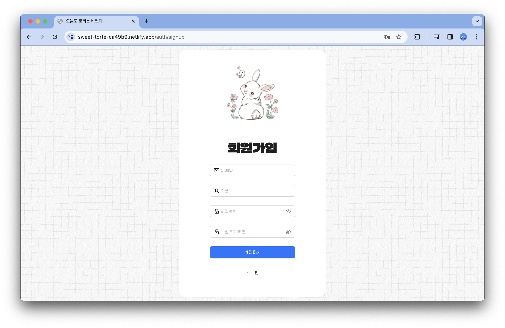
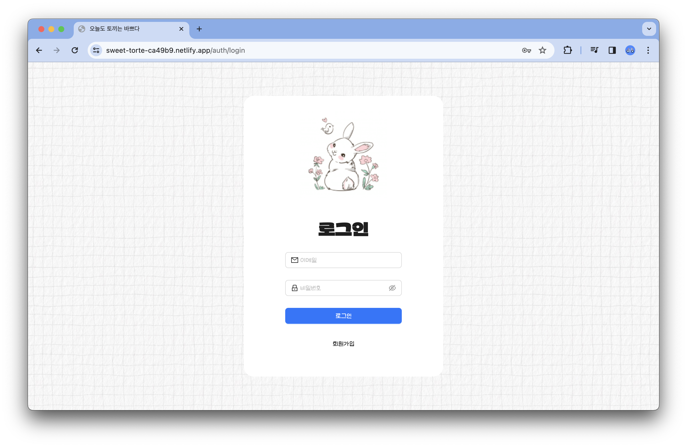
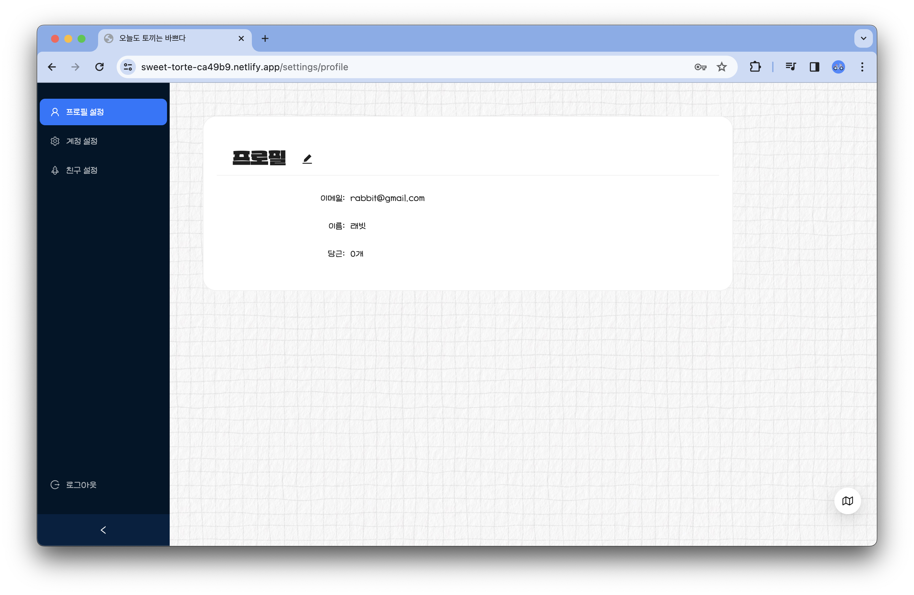
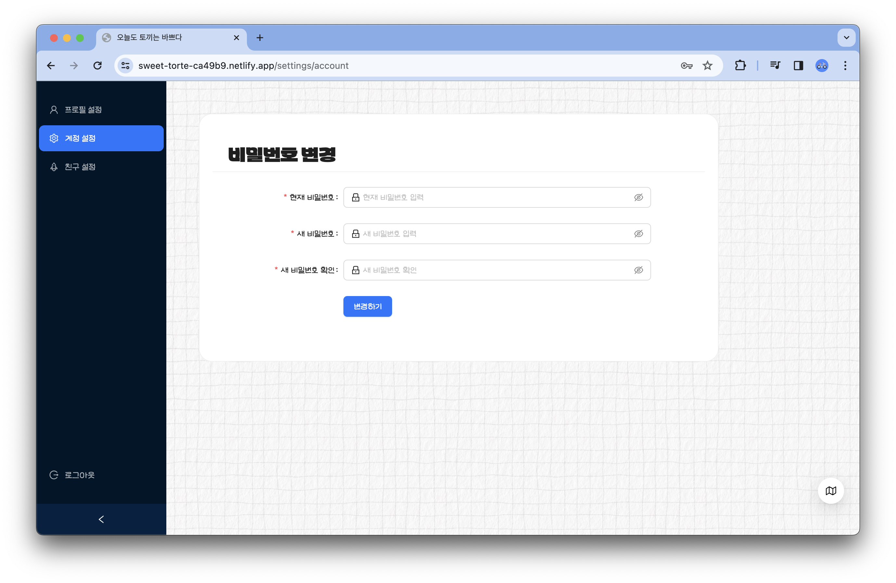
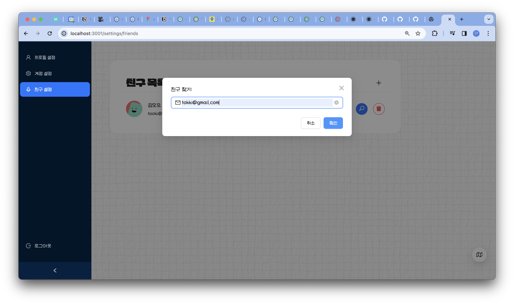
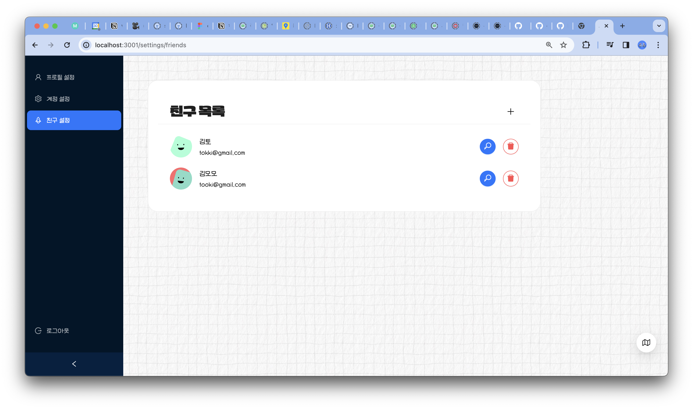
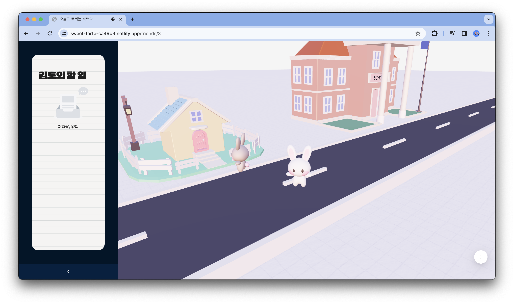
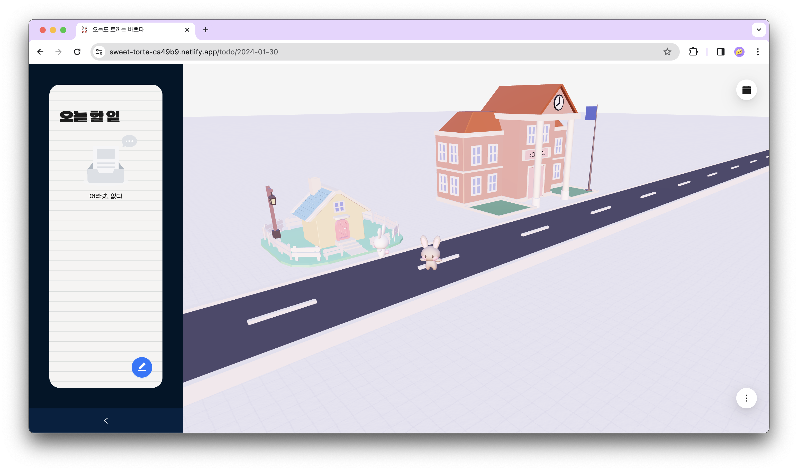

# **오늘도 토끼는 바쁘다**

---


# Developers

---

KAIST 전산학부 21학번 김현아

한양대학교 생명과학과 20학번 강다희

## 시작하는 방법

---

```bash
npm run dev
# or
yarn dev
# or
pnpm dev
# or
bun dev
```

# 사용된 기술

---

- **프론트엔드:** React
- **백엔드:** Express.js, Socket.io
- **Cloud:** Kcloud
- **DB:** MySQL
- **3D Modeling/Rendering:** Blender, Three.js

# 프로젝트 소개

---

3D ToDo 웹사이트입니다. 토끼가 가상환경에서 나의 todo list대로 일을 수행합니다. 친구의 todo map에 방문하여 친구와 todo 진행상황을 공유할 수 있습니다.

# 기능 소개

---

### 1. 회원가입/로그인

|        |      |
| ------------------------------------------------- | ----------------------------------------------------------------- |
|          |    |
|  |  |
|  |                                                                   |

### 2. ToDo 관리

오늘 하루의 ToDo list에 task명과 수행장소를 설정할 수 있습니다.

|  |  |
| --------------------------------------------- | --------------------------------------------------------- |

ToDo 리스트에서 원치않는 task는 삭제할 수 있습니다.

|  |     |
| -------------------------------------------------------- | --- |

Calendar에서 다른 날짜의 ToDo를 확인할 수 있습니다.

|  |     |
| ------------------------------------------------------------ | --- |

사용자는 map에서 3D 토끼를 직접 이동시키며 task를 수행시킬 수 있습니다. task가 완료되면 왼쪽 사이드바의 task 수행 상태가 완성으로 바뀌고, 사용자의 당근 수가 하나 늘어납니다.

|  |     |
| ----------------------------------------------------- | --- |

task와 장소에 따라, 토끼가 해당 일을 수행하는 애니메이션을 볼 수 있습니다.

### 3. 3D ToDo Map

Main 화면

|  |     |
| --------------------------------------------- | --- |

Home 화면/School 화면

|  |  |
| -------------------------------------------------- | ------------------------------------------------------ |

공부하는 토끼

|  |  |
| ------------------------------------------------------- | ------------------------------------------------- |

과제하는 토끼

|  |  |
| ---------------------------------------------------- | ---------------------------------------------- |

운동하는 토끼

|  |  |
| ------------------------------------------------------ | ------------------------------------------------ |

세탁하는 토끼

|  |  |
| ------------------------------------------------------ | ------------------------------------------------ |

청소하는 토끼

|  |  |
| ------------------------------------------------------- | ------------------------------------------------- |

### 4. 친구 추가

이메일 주소를 통해 친구를 추가할 수 있으며, 친구 삭제를 할 수 있습니다.

|  |  |
| ------------------------------------------ | --------------------------------------------- |

친구의 todo map에 방문하여 친구와 todo 진행상황을 공유할 수 있습니다.
친구의 map에서 실시간으로 친구 토끼의 위치를 확인할 수 있습니다.

|  |  |
| -------------------------------------------- | ---------------------------------------------- |
